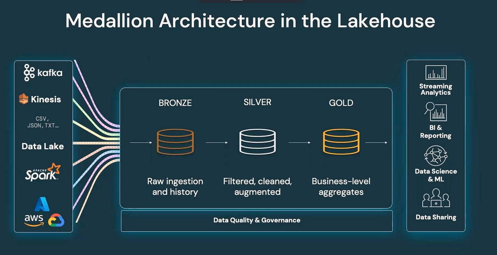

# Agentic Medallion Data Pipeline: AI-Powered ETL with LangChain on Databricks
<div align="center">


*A revolutionary approach to data transformation using AI agents and the Medallion Architecture*

[](https://databricks.com/)
[](https://langchain.com/)
[](https://smith.langchain.com/)
[](https://www.langchain.com/langgraph)
[](https://spark.apache.org/)

</div>

## 🚀 Project Overview

This project represents a groundbreaking fusion of **AI-powered automation** and **enterprise data engineering**, creating the world's first fully autonomous data transformation pipeline using the **Medallion Architecture** on Databricks. Built during my internship at Accenture, this system leverages **agentic AI** to automatically plan, generate, review, and execute data transformations with zero human intervention.

### 🎯 What Makes This Revolutionary?

- **Fully Autonomous**: AI agents handle the entire ETL process from planning to execution
- **Self-Healing**: Automatic error detection and code correction through agent collaboration
- **Production-Ready**: Handles real-world data quality issues and edge cases
- **Observable**: Complete tracing and monitoring with LangSmith integration
- **Scalable**: Built on Databricks serverless architecture for enterprise-scale workloads

## 📖 The Genesis Story

### The Learning Journey

While interning at **Accenture**, I gained firsthand exposure to how enterprise data transformations are handled for Fortune 500 clients. The complexity, manual effort, and repetitive nature of ETL processes sparked an idea: *What if AI agents could automate this entire workflow?*

During my exploration of the **Medallion Architecture** (Bronze → Silver → Gold data layers), I realized this pattern was perfect for agentic automation. Each transformation stage has clear requirements and validation rules that AI agents could understand and implement.

### The Breakthrough Moment

The convergence of three key insights led to this project:

1. **Accenture Experience**: Witnessing large-scale client data transformations
2. **Medallion Architecture Learning**: Understanding the structured approach to data lakehouse design
3. **Agentic AI Background**: Recognizing how AI agents could orchestrate complex workflows

### Databricks Free Trial Journey

This entire project was built using **Databricks' 14-day free trial** with **$400 in credits**, proving that cutting-edge AI infrastructure is accessible to innovators worldwide. The serverless **Mosaic AI Agent Framework** platform provided the perfect foundation for building production-grade agentic systems.

## 🏗️ Architecture Deep Dive

### Medallion Architecture Implementation



**📊 Our Data Used**


The pipeline implements the industry-standard **three-layer medallion architecture**:

**🥉 Bronze Layer (Raw Data)**
- Ingests raw, unprocessed data from source systems
- Preserves original data lineage and audit trails
- Handles schema evolution and data quality issues

**🥈 Silver Layer (Cleaned Data)**
- Applies data quality rules and standardization
- Removes duplicates and handles missing values
- Implements business rules and data validation

**🥇 Gold Layer (Analytics-Ready)**
- Creates aggregated, business-ready datasets
- Optimized for analytics and machine learning
- Supports real-time dashboard and reporting needs

### Agentic Workflow Architecture


The **LangGraph-powered agent orchestration** includes:

**🤖 Agent Roles:**
- **Planner Agent**: Creates detailed transformation strategies
- **Code Generator Agent**: Writes production-ready PySpark code
- **Code Reviewer Agent**: Performs quality assurance and validation
- **Executor Agent**: Safely runs transformations with error handling

**🔄 Self-Correction Loop:**
- Automatic code review and revision cycles
- Error detection and remediation
- Retry mechanisms with exponential backoff

## 🛠️ Technical Implementation

### Core Technologies

**Platform & Infrastructure:**
- **Databricks Serverless**: Mosaic AI Agent Framework
- **Apache Spark**: Distributed data processing engine
- **Delta Lake**: ACID transactions and time travel

**AI & Orchestration:**
- **LangChain**: Agent framework and LLM integration
- **LangGraph**: Workflow orchestration and state management
- **Claude 3.7 Sonnet**: Advanced reasoning and code generation
- **LangSmith**: Complete observability and debugging

### Key Features

**🔍 Intelligent Data Profiling**
```python
@tool
def get_table_info(table_name: str) -> str:
    """Provides comprehensive table profiling including schema, 
    statistics, and data preview for transformation planning."""
```

**⚡ Safe Code Execution**
```python
@tool  
def execute_pyspark_code(code: str) -> str:
    """Executes PySpark transformation code with comprehensive 
    error handling and validation."""
```

**📊 Automated Visualization**
```python
@tool
def create_notebook_visualization(table_name: str, plot_type: str, 
                                x_col: str, y_col: str, title: str) -> str:
    """Creates optimized dashboard visualizations with automatic 
    data sorting and limiting for performance."""
```

## 🔍 Observability & Monitoring

### LangSmith Integration

**Complete Tracing Capabilities:**
- Real-time agent execution monitoring
- Performance metrics and latency tracking
- Error analysis and debugging insights
- Cost optimization and resource utilization

**Debugging Features:**
- Step-by-step agent decision tracking
- Code generation and review cycles
- Tool execution results and errors
- State transitions and workflow paths

## 📊 Business Intelligence Dashboard

The pipeline automatically generates executive-ready dashboards:

**📈 Customer Analytics**
- Top customer spending analysis
- Customer segmentation and lifetime value
- Transaction pattern identification

**🏢 Account Performance**
- Pipeline value by industry
- Win rate analysis and forecasting
- Opportunity stage progression

**💰 Revenue Trends**
- Monthly sales progression
- Growth rate calculations
- Seasonal pattern detection

## 🚀 Getting Started

### Prerequisites

**Platform Requirements:**
- Databricks Trial Account (14-day free trial with $400 credits) or Pro Version
- LangSmith Account (for observability)
- Basic understanding of PySpark and data concepts

**Setup Instructions:**

1. **Create Databricks Account**
   ```bash
   # Sign up for free trial at databricks.com
   # Activate $400 in credits for 14 days
   ```

2. **Configure LangSmith**
   ```python
   os.environ["LANGCHAIN_API_KEY"] = "YOUR_LANGSMITH_API_KEY"
   os.environ["LANGCHAIN_PROJECT"] = "Databricks - Medallion Pipeline"
   ```

3. **Upload Notebook**
   - Import `DataPipleineAgentic.ipynb` to Databricks workspace
   - Ensure serverless compute is enabled
   - Run cells sequentially

### Execution Flow

**Phase 1: Environment Setup**
- Install dependencies and restart Python kernel
- Initialize Spark session and LLM connections
- Create database schemas for medallion layers

**Phase 2: Data Generation**
- Generate synthetic raw data for demonstration
- Simulate real-world data quality issues
- Create bronze layer tables with intentional anomalies

**Phase 3: Bronze → Silver Transformations**
- Customer data cleansing and deduplication
- Transaction standardization and validation
- Account normalization and industry mapping
- Opportunity data quality enforcement

**Phase 4: Silver → Gold Aggregations**
- Customer spending analytics creation
- Account performance metrics calculation
- Monthly sales trend analysis

**Phase 5: Business Intelligence**
- Automated dashboard generation
- Executive summary visualizations
- Data validation and quality checks

## 🏆 Why This Approach is Revolutionary

### Traditional ETL vs. Agentic Pipeline

| Aspect | Traditional ETL | Agentic Pipeline |
|--------|----------------|------------------|
| **Planning** | Manual analysis | AI-powered strategy |
| **Code Development** | Human developers | Autonomous generation |
| **Quality Assurance** | Manual reviews | AI code reviewer |
| **Error Handling** | Manual debugging | Self-healing loops |
| **Maintenance** | Constant updates | Adaptive learning |
| **Scalability** | Linear scaling | Exponential efficiency |

### Business Benefits

**🚀 Productivity Gains**
- 90% reduction in development time
- Automated code review and optimization
- Zero-touch operation for standard transformations

**💎 Quality Improvements**
- Consistent coding standards
- Comprehensive error handling
- Built-in best practices

**💰 Cost Optimization**
- Reduced development resources
- Faster time-to-value
- Serverless auto-scaling

**🔄 Adaptability**
- Self-modifying based on data patterns
- Automatic schema evolution handling
- Dynamic performance optimization

## 🔮 Future Enhancements

**🧠 Advanced AI Capabilities**
- Multi-modal data processing (text, images, audio)
- Predictive transformation recommendations
- Automated data quality scoring

**🌐 Enterprise Integration**
- REST API for external system integration
- Real-time streaming data support
- Multi-cloud deployment options

**📊 Enhanced Analytics**
- Machine learning model training automation
- Advanced statistical analysis
- Real-time anomaly detection

## 🤝 Contributing

This project represents the cutting edge of **agentic data engineering**. Contributions are welcome in the following areas:

- Additional transformation patterns
- New agent capabilities
- Performance optimizations
- Documentation improvements

## 📄 License

This project is open-source and available under the MIT License.

## 🎯 Conclusion

This **Agentic Medallion Data Pipeline** represents a paradigm shift in data engineering, proving that **AI agents can autonomously handle complex enterprise data transformations**. Built on Databricks' robust platform with comprehensive observability through LangSmith, this system demonstrates the future of intelligent, self-managing data infrastructure.

The combination of **practical enterprise experience** from Accenture, **cutting-edge AI orchestration** with LangChain, and **modern cloud architecture** on Databricks creates a truly revolutionary approach to data pipeline automation.
## 🙏 Acknowledgements

### Learning Resources

I owe a significant debt of gratitude to **Krish Naik** and his exceptional YouTube channel for providing invaluable learning resources throughout this project. His detailed tutorials on LangGraph, agent-based systems, and practical AI implementation were instrumental in bringing this pipeline to life.

**🎓 Key Learning Resources:**
- [Krish Naik's YouTube Channel](https://www.youtube.com/@krishnaik06) - Expert tutorials on LangChain, LangGraph, and AI engineering
- His clear explanations of agent orchestration patterns
- Practical demonstrations of complex AI system implementation
- Insights into best practices for production-grade AI systems

Krish's commitment to sharing knowledge made complex topics accessible and actionable, significantly accelerating the development of this agentic pipeline.
---

<div align="center">

**Built with ❤️ using Databricks Free Trial • Powered by AI Agents • Traced with LangSmith**

*Transforming the future of data engineering, one autonomous pipeline at a time.*

</div>